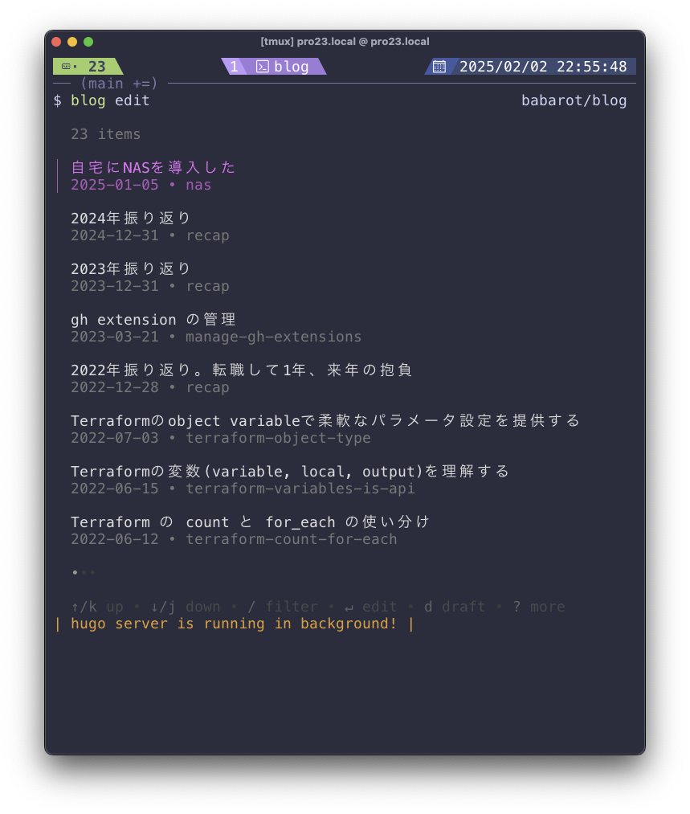

# blog—Makes writing blogs easier!

<p align="center">
  
</p>

This is a CLI tool that makes writing blog posts easier. It is primarily designed for publishing on [tellme.tokyo](https://tellme.tokyo).

When you run this app with the `edit` command, you can browse and select existing articles using a user-friendly UI. Internally, this app runs a [Hugo](https://gohugo.io/) server as a background process, allowing you to access [http://localhost:1313](http://localhost:1313) while writing—without needing to start the Hugo server manually!

## Usage

To edit an existing blog post:

```console
blog edit
```

To create a new post:

```console
blog new
```

## Installation

Using [afx](https://github.com/babarot/afx):

```yaml
github:
- name: babarot/blog
  description: A tool to simplify blog writing.
  owner: babarot
  repo: blog
  release:
    name: blog
    tag: v0.1.10
  command:
    link:
    - from: blog
```
```bash
afx install
```

## License

MIT
