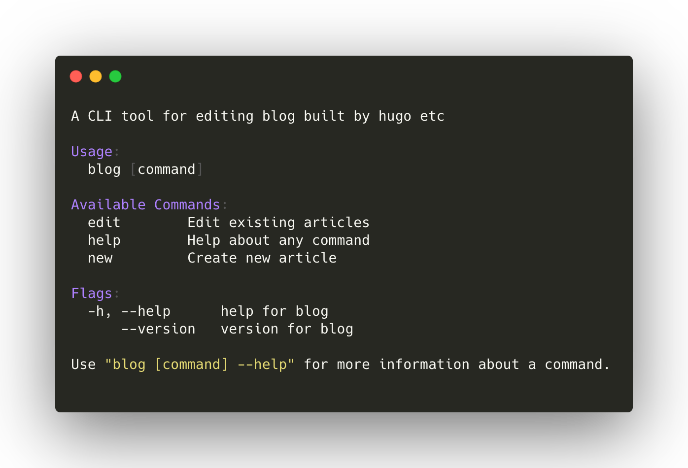

blog
====

  

This tool is mainly for writing [tellme.tokyo](https://github.com/b4b4r07/tellme.tokyo) blog. If you run this app with `edit `command, you can choise the exisiting articles with cool [prompt](https://github.com/manifoldco/promptui). Internally, this app makes hugo server run as background process. So it makes you easy to access localhost:1313 while writing your post without calling hugo server separately!

## Installation

Download the binary from [GitHub Releases][release] and drop it in your `$PATH`.

- [Darwin / Mac](https://github.com/b4b4r07/blog/releases/latest)
- [Linux](https://github.com/b4b4r07/blog/releases/latest)

## Notes 

This tool idea basically comes from:

- [スムーズに Hugo でブログを書くツール | tellme.tokyo](https://tellme.tokyo/post/2018/10/16/write-blog-smoothly/)
- [tellme.tokyo/cmd/blog at master · b4b4r07/tellme.tokyo](https://github.com/b4b4r07/tellme.tokyo/tree/master/cmd/blog)

## License

[MIT][license]

## Author

b4b4r07

[release]: https://github.com/b4b4r07/blog/releases
[license]: https://b4b4r07.mit-license.org
